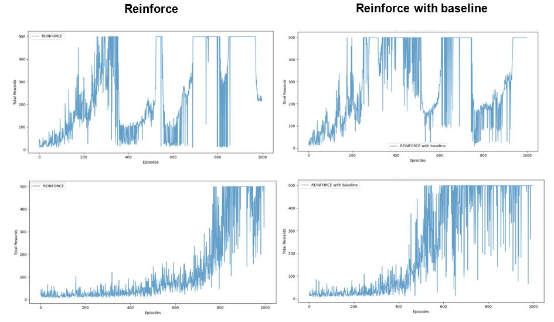
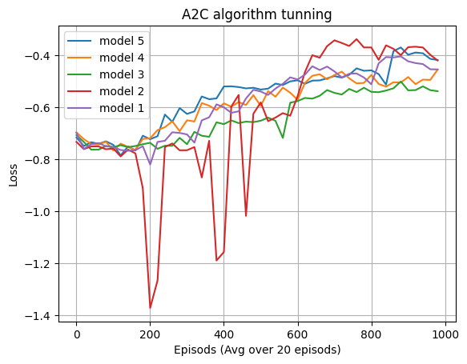
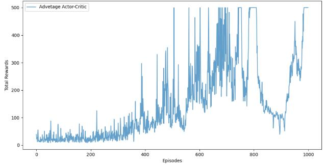
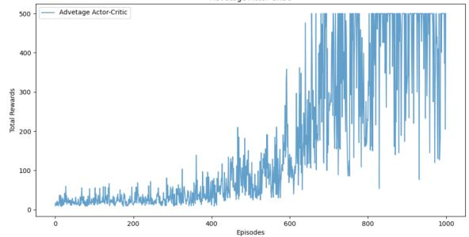
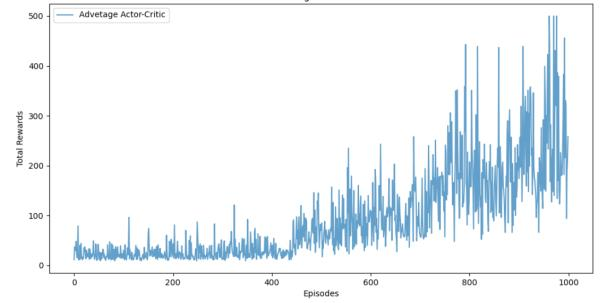
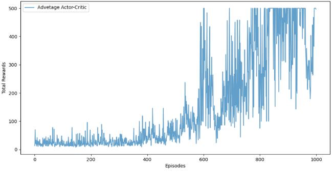
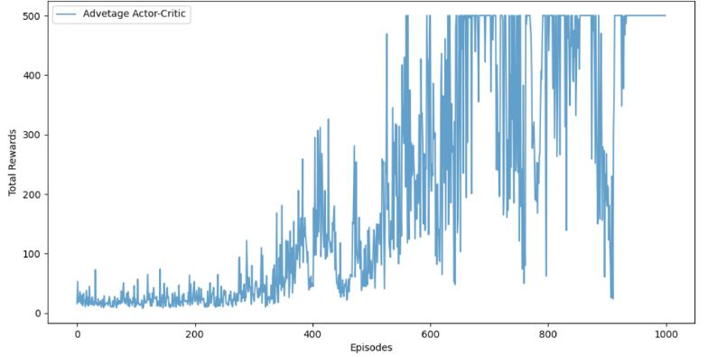
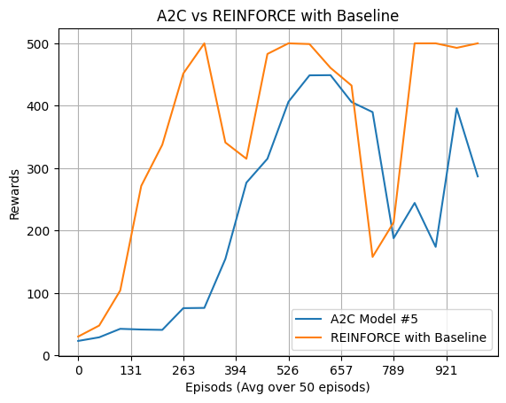

# Deep Reinforcement Learning - Assignment #2

**Ben-Gurion University of the Negev**
Faculty of Engineering Sciences | Department of Software and Information Systems

**Authors:** Oz Elbaz (204388763), Ido Gurevich (205478068)

---

## Overview

This project implements and compares three policy gradient methods for solving the **CartPole-v1** environment from Gymnasium:

1. **REINFORCE** (Monte-Carlo Policy Gradient)
2. **REINFORCE with Baseline**
3. **Advantage Actor-Critic (A2C)**

The CartPole environment has a 4-dimensional continuous state space and 2 discrete actions (push left / push right). The goal is to balance a pole on a cart for as long as possible, with a maximum of 500 steps per episode.

---

## Section 1 - Monte-Carlo Policy Gradient (REINFORCE)

### Key Concepts

- The **advantage estimate** measures the difference between the actual return obtained after taking an action and the expected value of the state under the current policy. A positive advantage indicates the action performed better than average; a negative advantage indicates it performed worse. Using the advantage instead of the raw return for gradient computation **reduces variance** while preserving the unbiased nature of the gradient, leading to faster and more stable convergence.

- The **baseline subtraction** does not introduce bias to the policy gradient. This holds because the baseline `b(s)` depends only on the state and is independent of the action. Since the gradient of the policy summed over all actions equals zero (i.e., `sum_a nabla pi(a|s) = 0`), the expectation `E[nabla log pi(a|s) * b(s)]` evaluates to zero. The baseline therefore only affects variance, not the expected direction of the gradient update.

### Architecture

- **REINFORCE:** A single policy network with hidden layers `[16, 8]`, outputting action probabilities via softmax.
- **REINFORCE with Baseline:** Two networks — a policy network and a value network — both with hidden layers `[16, 8]`. The value network estimates `V(s)` and serves as the baseline.

### Hyperparameter Search

| Parameter | Values Tested |
|---|---|
| Learning rate (policy / value) | 0.001, 0.005, 0.01 |
| Discount factor | 0.99, 0.995, 0.999 |
| Max episodes | 1000 |
| Max steps per episode | 500 |

### Results

At a learning rate of 0.001, the vanilla REINFORCE algorithm exhibited significant oscillations in cumulative reward, while the baseline variant showed a smoother learning curve. At a learning rate of 0.005, both algorithms showed improved convergence, with the baseline version still outperforming in stability.

The best configuration converged at around **600 episodes** with:
- Learning rate: **0.005**
- Discount factor: **0.999**

These results confirm that the baseline reduces variance and improves learning stability, producing more consistent policy updates.


*Figure 1: Hyperparameter tuning results. Left column: REINFORCE. Right column: REINFORCE with Baseline. Top row: LR=0.001. Bottom row: LR=0.005.*

---

## Section 2 - Advantage Actor-Critic (A2C)

### Key Concepts

- The **TD-error** of the value function (`delta = R + gamma * V(s') - V(s)`) is practically equivalent to the advantage estimate. In expectation, conditioned on state and action, the TD-error equals `Q(s,a) - V(s)`, which is exactly the advantage `A(s,a)`. This means using the TD-error for the policy update is the same as using the advantage, but with a lower-variance, bootstrapped estimate.

- In the **Actor-Critic** framework, the **actor** is the policy network — it decides which action to take by sampling from the learned policy distribution. The **critic** is the value network — it evaluates how good a state is and provides feedback (via the TD-error / advantage) to guide the actor's updates through policy gradients.

### Architecture & Hyperparameter Search

Five model configurations were tested:

| Model | PolicyNet Hidden Sizes | ValueNet Hidden Sizes | LR Policy | LR Value | Discount |
|---|---|---|---|---|---|
| (1) | [256, 128, 32] | [256, 128, 32] | 0.0009 | 0.0009 | 0.999 |
| (2) | [64, 64, 32] | [64, 64, 32] | 0.005 | 0.005 | 0.995 |
| (3) | [128, 64, 16] | [128, 64, 16] | 0.0009 | 0.0009 | 0.999 |
| (4) | [64, 64, 32] | [64, 64, 32] | 0.0009 | 0.0009 | 0.999 |
| **(5)** | **[256, 64, 32]** | **[256, 64, 32]** | **0.001** | **0.001** | **0.999** |

### Results

All models converged to some degree. Model (3) had the worst loss performance, model (2) was unstable throughout training, and models (1), (4), and (5) achieved similar results. **Model (5)** emerged as the best overall, reaching peak cumulative reward in just over 600 episodes.


*Figure 2: A2C loss comparison across all five model configurations (averaged over 20 episodes).*

| Model (1) | Model (2) |
|---|---|
|  |  |
| **Model (3)** | **Model (4)** |
|  |  |

*Figure 3: Cumulative reward per episode for each A2C model configuration.*


*Figure 4: Results of the best model (Model 5) — cumulative reward per episode.*

---

## Comparison: A2C vs REINFORCE with Baseline

When comparing the best A2C model (#5) against REINFORCE with Baseline, the REINFORCE variant accumulated higher overall rewards — contrary to the initial expectation that A2C would outperform it. This can be attributed to suboptimal hyperparameter tuning for A2C, as well as a fundamental difference in update frequency: REINFORCE updates at every step within an episode, while A2C updates at the end of each episode. This makes REINFORCE less stable but allows it to learn faster in terms of episodes needed.


*Figure 5: Reward comparison between A2C (Model #5) and REINFORCE with Baseline (averaged over 50 episodes).*

---

## Project Structure

```
RL_ass2/
├── REINFORCE.py          # REINFORCE and REINFORCE with Baseline implementation
├── ActorCritic.py        # Advantage Actor-Critic (A2C) implementation
├── Assignment2_Report.pdf
├── requirements.txt
├── images/               # Result plots
│   ├── fig1_reinforce_hyperparameter_tuning.jpeg
│   ├── fig2_a2c_loss_tuning.png
│   ├── fig3_a2c_model5_rewards.jpeg
│   ├── fig4_a2c_model1_rewards.jpeg
│   ├── fig5_a2c_model2_rewards.jpeg
│   ├── fig6_a2c_model3_rewards.jpeg
│   ├── fig7_a2c_model4_rewards.jpeg
│   └── fig8_a2c_vs_reinforce.png
└── README.md
```

## Setup & Usage

### 1. Create and activate virtual environment

```bash
python -m venv venv

# Windows
venv\Scripts\activate

# Linux/Mac
source venv/bin/activate
```

### 2. Install dependencies

```bash
pip install -r requirements.txt
```

### 3. Run the algorithms

```bash
# REINFORCE (toggle baseline by commenting/uncommenting in main())
python REINFORCE.py

# Advantage Actor-Critic
python ActorCritic.py
```

> **Note:** To switch between REINFORCE and REINFORCE with Baseline, modify the `main()` function in `REINFORCE.py` by commenting/uncommenting the appropriate optimization call.
